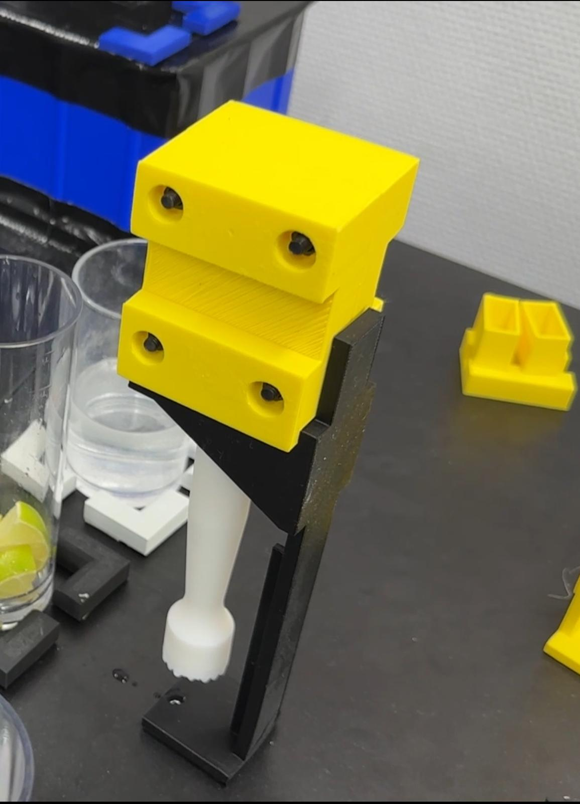

# Muddler

# Table of Contents

1. [Introduction](#introduction)
2. [Preparations](#preparations)
   - [CPEE](#cpee)
   - [Universal Robot](#universal-robot)
3. [Execution](#execution)
4. [Processes](#processes)
   - [Pouring content into a cocktail glass](#pouring-content-into-a-cocktail-glass-muddler_add_contentsxml)
   - [Muddling content](#muddling-content-mudder_muddlingxml)
5. [3D Prints](#3d-prints)
6. [Other possibilities](#other-possibilities)

## Introduction

This process aims to make specific cocktails like Mojitos, Caipirinhas,or Smashes as authentic as possible by including muddling into the cocktail-making process.

### CPEE 
The CPEE tool is a modular, service-oriented workflow execution engine (More information: [CPEE](https://cpee.org/)). It handles the cocktail processing logic and makes API calls to the [Universal Robot](https://www.universal-robots.com/de/) which then executes predefined processes.

## Instructions

### Universal Robot

The robot has to be set to “Automatic” and then to “Remote Control”.

### Physical preparation

There is an array of glasses in 3x3 filled with glasses. The user can now put contents into the glasses. Each column can be filled up with up to 3 contents. In this case, we will add mint, lime, and sugar to each column (Starting with mint at the bottom). Therefore, it is possible to prepare three glasses of cocktails.

### CPEE

* Visit the [Process Hub](https://cpee.org/hub/?stage=development&dir=Teaching.dir/Prak.dir/TUM-Prak-24-SS.dir/)
* Open “Muddler_demo.xml”
* The Graph on the bottom half should be like this:
  

* To execute the process, click on start in the execution tab on the top left:
  

#### Subprocesses

This Demo uses subprocesses which also require data elements. To create subprocesses, a service call needs to be inserted which then should have the string "subprocess" in the endpoint. The subprocess now requires the link of the actual process that it starts and also passes the needed data elements.

### Execution

To begin the process, start the instance in the CPEE for execution. The robot will then add the contents from the first column into the cocktail glass. Next, it will take the muddler from the stand and muddle the poured contents in the cocktail glass. After muddling, the robot will clean the muddler by stirring it in a clean glass and returns it to the stand. In this demo, the process will do this three times and returns back to the home position.

## Processes

The Process is divided into 2 sub-processes. It starts by adding the content into the cocktail glass and proceeds with the mudding sub-process. Both sub-processes work independently and can be used for other processes.

### Pouring content into a cocktail glass (“Muddler_add_contents.xml”)

The robot can add content from up to three different glasses into the cocktail glass. The robot operates by setting a position (the bottom left glass) and hovering above the glasses with an offset.

Adding the content from only one or two glasses is also possible. This is possible by setting the variable “ingredient_limit” to [1,2,3] in the main process that executes the subprocesses. This will limit the number of considered glasses. The robot always starts from the lowest glass and proceeds to the next one in the column. If the variable “ingredient_limit” is set to “2, " the robot will choose the 2 lowest glasses in the glass array/ column.

The subprocess receives the second variable, “glass_array_pos.” This is also important as it decides which column to choose. In the demo, the instance starts on the left and proceeds to the right. Therefore, all columns are identical, and the “refiller” has time to clean up the glasses and refill the content.

### Muddling content (“Mudder_muddling.xml”)

After adding the contents, the robot takes the muddler from the stand and moves to the cocktail. It then muddles the contents from different positions and goes to the cleaning glass beside the stand.

## Muddler

The muddler is bought via [Amazon](https://amzn.eu/d/gs9YuMl) and the size is 20,7 * 2,5 CM.

## 3D Prints

The muddler stand and holder are 3D printed. Both files can be found in the repository under the "3D Models" folder.

Muddler Stand: Stores the muddler when not in use.
Holder: Assists the robot in grabbing the muddler, printed in two parts which are held together by four M5 screws and nuts.

## Other possibilities

It is also possible to create a cocktail-based decision, where each column/ glass array is one type of cocktail. In this example (“Muddler_demo_2.xml”, [Process Hub](https://cpee.org/hub/?stage=development&dir=Teaching.dir/Prak.dir/TUM-Prak-24-SS.dir/)), the data element “cocktail_name” needs to match with one of the three cocktails. It would then set the array and limit the amount of glasses poured into the cocktail glass. This process would run once per cocktail.

### Logic Example

In order to make a decision, a condition can be used which then executes a script that sets the used array of glass. 

The script changes the two data elements glass_array_pos and ingredient_limit. The first variable decides which column/ array of glasses is chosen and the second tells how many glasses (up to 3) are needed.

    data.glass_array_pos = 0
    data.ingredient_limit = 3

After that, the subprocess needs to be executed with the data elements

